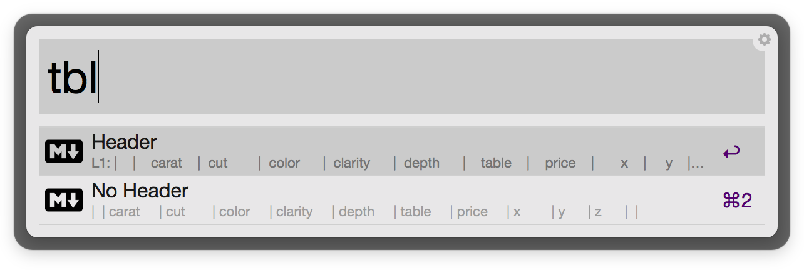

# markdown-table-alfred

An Alfred workflow for generating markdown tables from your clipboard.

#### [Download](https://github.com/danielecook/markdown-table-alfred/raw/workflow/markdown-tables.alfredworkflow)

## Usage

Copy a csv or tsv. The script will attempt to intelligently guess the format. For example, if you copy the table below:

```
carat   cut color   clarity depth   table   price   x   y   z
0.23    Ideal   E   SI2 61.5    55  326 3.95    3.98    2.43
0.21    Premium E   SI1 59.8    61  326 3.89    3.84    2.31
0.23    Good    E   VS1 56.9    65  327 4.05    4.07    2.31
0.29    Premium I   VS2 62.4    58  334 4.2 4.23    2.63
0.31    Good    J   SI2 63.3    58  335 4.34    4.35    2.75
```

Then type `tbl` in alfred and you will see the following:



You can create a table with or without a header. It will be copied to your clipboard as this: 

```
|   carat | cut     | color   | clarity   | depth   |   table |   price |      x |    y |    z |
|--------:|:--------|:--------|:----------|:--------|--------:|--------:|-------:|-----:|-----:|
|    0.23 | Ideal   | E       | SI2       | 61.5    |    55   |     326 |   3.95 | 3.98 | 2.43 |
|    0.21 | Premium | E       | SI1       | 59.8    |    61   |     326 |   3.89 | 3.84 | 2.31 |
|    0.23 | Good    | E       | VS1       | 56.9    |    65   |     327 |   4.05 | 4.07 | 2.31 |
|    0.29 | Premium | I       | VS2       | 62.4    |    58   |     334 |   4.2  | 4.23 | 2.63 |
|    0.31 | Good    | J       | SI2       | 63.3    |    58   |     335 |   4.34 | 4.35 | 2.75 |
```

And it will render like this:

|   carat | cut     | color   | clarity   | depth   |   table |   price |      x |    y |    z |
|--------:|:--------|:--------|:----------|:--------|--------:|--------:|-------:|-----:|-----:|
|    0.23 | Ideal   | E       | SI2       | 61.5    |    55   |     326 |   3.95 | 3.98 | 2.43 |
|    0.21 | Premium | E       | SI1       | 59.8    |    61   |     326 |   3.89 | 3.84 | 2.31 |
|    0.23 | Good    | E       | VS1       | 56.9    |    65   |     327 |   4.05 | 4.07 | 2.31 |
|    0.29 | Premium | I       | VS2       | 62.4    |    58   |     334 |   4.2  | 4.23 | 2.63 |
|    0.31 | Good    | J       | SI2       | 63.3    |    58   |     335 |   4.34 | 4.35 | 2.75 |


